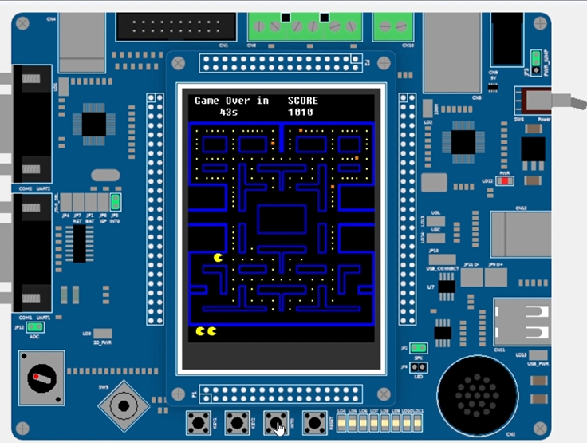

# Pac-Man for LandTiger LPC1768

This project implements a simplified version of Pac-Man for the LandTiger board based on the LPC1768 microcontroller.

## Features

- Maze displayed on the GLCD display.
- 240 standard pills and 6 randomly generated power pills.
- Pac-Man controlled through the joystick.
- Teleportation through the side passages of the central corridor.
- Score: 10 points for standard pills and 50 points for power pills.
- One initial life and one additional life for every 1000 points.
- 60-second countdown.
- `INT0` button to pause or resume the game.
- `Victory!` screen when all pills have been eaten.
- `Game Over!` screen when the time runs out.

## How to run

1. Open `extrapoint1/sample.uvprojx` with Keil μVision.
2. Select the `SW_Debug` target.
3. Build the project and start the software debugger.
4. Use the emulator joystick. The game starts paused; press `INT0` to start.
5. Press `RESET` to reset the system and restart the game.

# Video

[Watch the Pac-Man video](pacmanVideo.mp4)